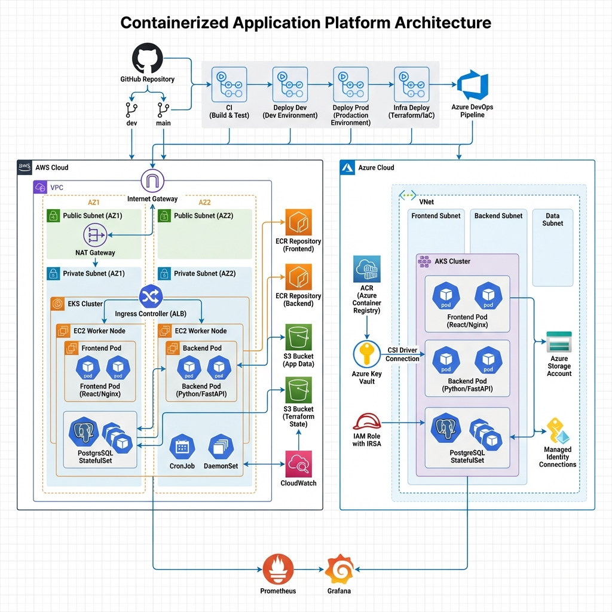

# TaskFlow - Cloud-Native Platform Engineering Capstone

## Overview
**TaskFlow** is a comprehensive, production-grade cloud-native application platform, designed to demonstrate mastery in Platform Engineering. 
It features a microservices-based Kanban application deployed across **AWS (EKS)** and **Azure (AKS)** using Infrastructure as Code (Terraform), Kubernetes (Helm), and CI/CD automation.

## Architecture



The platform demonstrates a complete cloud-native architecture with:
- **Multi-cloud deployment** across AWS and Azure
- **Automated CI/CD pipelines** using GitHub Actions and Azure DevOps
- **Infrastructure as Code** with Terraform and remote state management
- **Container orchestration** with Kubernetes (EKS/AKS)
- **Security best practices** including IRSA, Managed Identity, and secrets management
- **Observability** with Prometheus and Grafana


## **Repository Structure**

```
.
├── backend/                 # Python Flask Microservice (Distroless Dockerfile)
├── frontend/                # React/Nginx Microservice (Unprivileged Dockerfile)
├── infrastructure/          # Terraform IaC
│   ├── modules/             # Reusable Modules (vpc, eks, aks, s3...)
│   └── environments/        # environment configs (aws/main.tf, azure/main.tf)
├── k8s/                     # Kubernetes Manifests
│   └── taskflow-chart/      # Helm Chart (Templates + Values for envs)
├── monitoring/              # Observability Stack (Prometheus/Grafana)
├── scripts/                 # Utility scripts (scan_images.sh)
├── .github/workflows/       # GitHub Actions CI/CD
└── azure-pipelines.yml      # Azure DevOps Pipeline
```

---

## **Deployment Guide**

### **Prerequisites**
- Terraform >= 1.0
- Docker & Docker Compose
- kubectl & helm
- AWS CLI or Azure CLI configured

### **1. Infrastructure Deployment (AWS Example)**
```bash
cd infrastructure/environments/aws
terraform init
terraform apply -var-file="dev.tfvars"
# Output will provide the kubeconfig command
```

### 2. Build & Scan Images
```bash
# Build locally
docker-compose build

# Scan manually (requires Trivy installed)
trivy image taskflow-dev-backend:latest
```

### **3. Application Deployment (Kubernetes)**
```bash
# Deploy to Dev environment
helm upgrade --install taskflow ./k8s/taskflow-chart \
  --namespace dev --create-namespace

# Deploy to Prod with overrides
helm upgrade --install taskflow ./k8s/taskflow-chart \
  --namespace prod --create-namespace \
  -f k8s/taskflow-chart/values-prod.yaml
```

### **4. Observability Setup**
```bash
./monitoring/deploy.sh
# Follow instructions to access Grafana dashboards
```

---

## **Design Decisions & Trade-offs**

### **1. Container Security**
- **Decision**: Use `gcr.io/distroless/python3` for backend.
- **Why**: Drastically reduces attack surface (no shell, no package manager in prod).
- **Trade-off**: Harder to debug (can't `exec` into pod easily), so we rely on logs and DaemonSet monitoring.

### **2. Secret Management**
- **Decision**: Use cloud-native identity (IRSA for AWS, Managed Identity for Azure).
- **Why**: Avoids long-lived credentials. Pods authenticate directly with the cloud provider to access S3/KeyVault.

### **3. Scaling Strategy**
- **Decision**: HPA based on CPU utilization (default 50%).
- **Why**: Stateless backend is CPU-bound.
- **Decision**: StatefulSet for DB.
- **Why**: Ensures stable network identity and orderly scaling/termination.

### **4. CI/CD Strategy**
- **Decision**: Atomic Helm upgrades.
- **Why**: Ensures if a deployment fails, it automatically rolls back to the previous stable state, minimizing downtime.
# trigger dev infrastructure deployment
